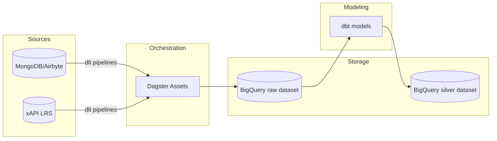

# Architecture & Operations

This repository packages an end-to-end ELT stack that is production-ready for Kubernetes deployments. The design embraces three layers: ingestion (dlt), orchestration (Dagster), and transformation (dbt).

## High-level flow

## Secrets and configuration

All secrets are environment-driven to play well with CI/CD and Kubernetes:

- `MONGO_USER`, `MONGO_PASSWORD`, `MONGO_HOST`, `MONGO_PORT`, `MONGO_DATABASE`
- `GOOGLE_APPLICATION_CREDENTIALS`, `GCP_PROJECT`, `GCP_BQ_DATASET`
- `XAPI_LRS_ENDPOINT`, `XAPI_AUTH_TOKEN`
- `DBT_PROFILES_DIR`, `DBT_TARGET`

Use Kubernetes Secrets and ConfigMaps to mount these values into the Dagster deployment. The Dagster run launcher should be configured with a service account that has BigQuery write permissions.

## Local development

- Spin up Dagster with `dagster dev -m dagster_project`.
- Use Airbyte's local MongoDB connector to extract data into the Mongo database, or point directly to your managed Mongo cluster.
- Execute assets via Dagster UI or CLI to run dlt loads and dbt transformations.

## CI/CD pipeline

GitHub Actions covers three guardrails:

1. Ruff linting for Python.
2. `dbt parse` to validate model syntax and dependencies.
3. `pytest` placeholder for unit tests (extend with Dagster asset unit tests and dbt macro tests).

Add deployment stages (ArgoCD, Helm) to roll out a container image built from the `Dockerfile`. The image can run both Dagster webserver and job code; in production, split into webserver + daemon containers for scalability.

## Icons and lineage

- Dagster assets carry descriptive metadata and group names to render lineage in the Dagster UI automatically.
- dbt documentation (`dbt docs generate`) will surface column-level lineage; use `dbt docs serve` to render with icons and table descriptions defined in the schema files.

## Reliability and validation

- dlt pipelines are incremental and resume on failure using load package state stored in BigQuery.
- dbt schema tests enforce uniqueness and non-null constraints on all primary keys in the silver layer.
- Additional data quality checks can be added through dbt expectations or Dagster software-defined assets.
