# Lineage and DAG descriptions

## Dagster assets

- **mongo_raw_ingestion** → writes Airbyte/MongoDB collections into BigQuery `raw` dataset tables.
- **xapi_raw_ingestion** → writes xAPI statements into BigQuery `raw.xapi_statements`.
- **dbt models** → depend on `raw` dataset sources to materialize silver dimensions and facts.
- **dbt_test_suite** → validates that silver models conform to constraints.

Dagster UI will render these assets with groupings (`ingestion`, `quality`) and show upstream/downstream relationships. Asset metadata includes markdown lineage notes and raw table names to quickly trace issues.

## dbt lineage

Use `dbt docs generate` to view node lineage with icons and descriptions. Models are organized as:

- `sources`: `raw_mongo` and `raw_xapi` with table descriptions matching the ingestion layer.
- `staging`: lightly cleaned views casting types and standardizing column names.
- `silver`: conformed models matching the provided dimensional schema. Each table carries a description and column-level notes to power dbt docs with icons.

## Mermaid view of silver layer

```mermaid
graph TD
    dim_time --> fact_learning_event
    dim_organization --> fact_learning_event
    dim_learner --> fact_learning_event
    dim_teacher --> fact_learning_event
    dim_course --> fact_learning_event
    dim_section --> fact_learning_event
    dim_content_item --> fact_learning_event
    dim_assessment --> fact_learning_event
    dim_skill --> fact_learning_event
    dim_session --> fact_learning_event
    dim_platform --> fact_learning_event
    dim_lti_tool --> fact_learning_event
    dim_ai_tool --> fact_ai_interaction
    dim_ai_tool --> fact_learning_event
    dim_learner --> fact_assessment_attempt
    dim_assessment --> fact_assessment_attempt
```

This lineage is reflected in dbt via `ref()` dependencies and enforced by unique/not-null tests on surrogate keys.
